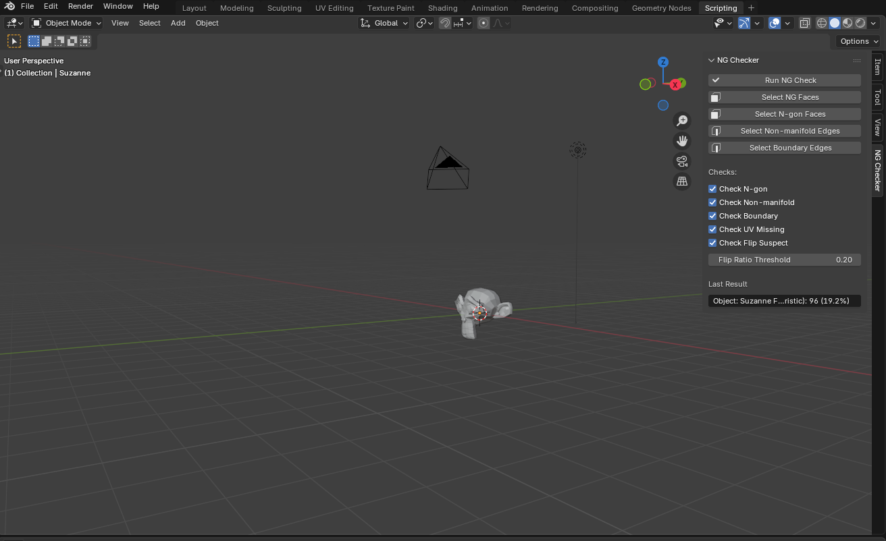
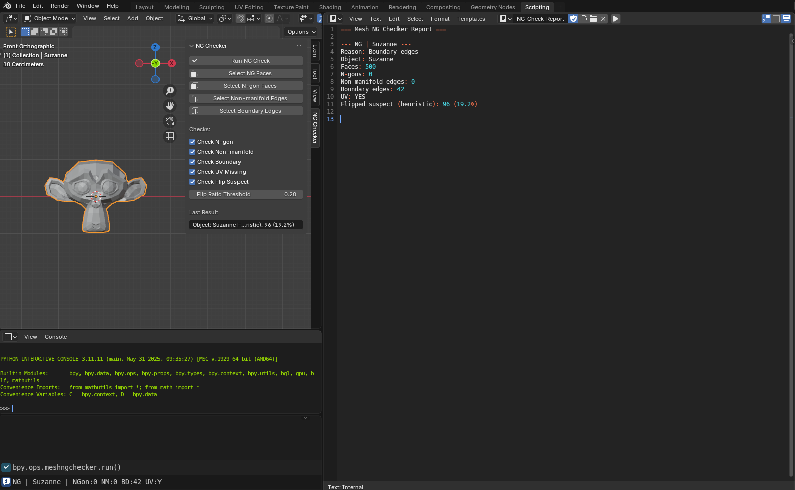
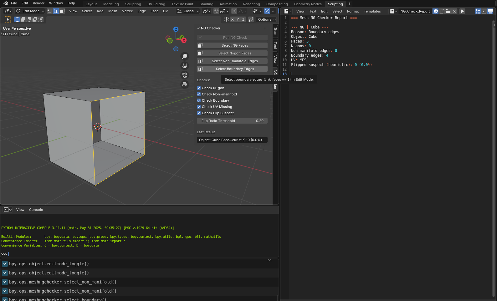

# Mesh NG Checker (Refactored+)

Blenderで**選択中のメッシュをまとめて解析**し、トポロジのNG（N-gon / Non-manifold / Boundary / UV Missing / Flip Suspect）を  
**レポート表示**＆**修正箇所の選択支援**まで行うアドオンです。

---

## What it does

- ✅ **複数オブジェクト選択に対応**（Object Modeで一括チェック）
- ✅ 結果を**サイドバーに表示** + **Text Editorに詳細レポート出力**
- ✅ Edit Modeで**NG箇所を選択**（NG Faces / Non-manifold / Boundary）

---

## Features

### Checks

- **N-gon**：5角以上の面（`len(face.verts) > 4`）
- **Non-manifold edges**：`link_faces >= 3` のエッジ
- **Boundary edges**：`link_faces == 1` のエッジ
- **UV Missing**：UVレイヤーが存在しない
- **Flip Suspect (heuristic)**：  
  面法線と「**メッシュ中心 → 面中心**」方向のドット積を用いた簡易判定（疑い）

### UI / Output

- **View3D > Sidebar > NG Checker** にパネル表示
- **Last Result** にオブジェクトごとの結果を表示
- Text Editorに **NG_Check_Report** を作成し、詳細ログを出力

### Selection Support (Edit Mode)

- **Select NG Faces**：チェックON/OFF条件に一致する面を選択
- **Select Non-manifold**：Non-manifoldエッジを選択
- **Select Boundary**：Boundaryエッジを選択

---

## Demo

### UI Panel

### Report

### Selection

---

## Requirements

- Blender **4.5**（※4.2+でも動作する可能性あり）
- OS：Windows / macOS / Linux

---

## Installation (Legacy Add-on / ZIP)

> ✅ ZIPの中身は **`mesh_ng_checker/` フォルダが入っていて、その中に `__init__.py` がある**構造が正解です。

1. `mesh_ng_checker` フォルダをZIP化（またはReleaseのZIPを使用）
2. Blenderを開く
3. `Edit > Preferences > Add-ons > Install...`
4. ZIPを選択してインストール
5. Add-ons一覧で **Mesh NG Checker** を有効化 ✅
Blender 4.2+ / 4.5: Preferences → Add-ons → 右上メニュー → Install from Disk… からZIPを選択
---

## Usage

### 1) Object Mode：一括チェック（複数選択OK）

1. Object Modeでメッシュを複数選択
2. **Run NG Check** を押す
3. **Last Result / INFOメッセージ / Text Editorのレポート**を確認

### 2) Edit Mode：NG箇所を選択

1. 修正したいオブジェクトをアクティブにする
2. Edit Modeへ移動
3. 目的のボタンを押す  
   - Select NG Faces  
   - Select Non-manifold  
   - Select Boundary  

---

## Notes / Known limitations

- **Flip Suspect は heuristic（簡易判定）**です。  
  Join後に離れた「島（connected components）」が複数ある場合、中心点（基準点）の影響で誤判定が増える可能性があります。  
  → 必要に応じて「島ごとに基準点を分ける」改善が可能です。

---

## Roadmap (optional)

- Flip Suspect の精度改善（島ごとに基準点を計算）
- CSV出力
- 自動修正（安全な範囲：法線再計算、Merge by Distance 等）
- UI整理（折りたたみ、表示の見やすさ改善）

---

## Development

### Code structure (overview)

- `analyze_bmesh(bm, obj)`：解析の本体（Object/Edit共通で使用）
- `MESHNGCHECKER_OT_run`：Object Modeで複数選択を回して解析
- Select系 Operators：Edit Modeで選択支援（`edge_flags` / `face_flags` を利用）
- Scene props：チェックON/OFF、閾値、Last Result文字列

---

## License

MIT

---

## Author

YourName

(link) GitHub: https://github.com/xxxxx

